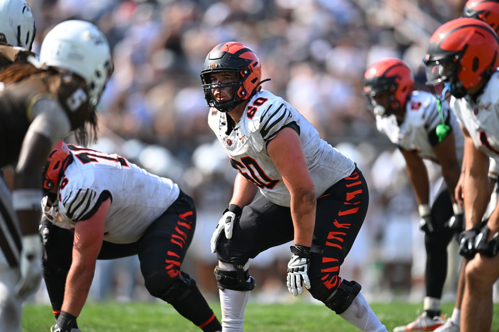

i am a rising senior at [Princeton University](https://princeton.edu) interesting largely in **systems biology, evolutionary genomics, and precision medicine**. my goal is to leverage the ever-advancing sequencing technologies available to progress genetic medicines to a personalized scale. 

at princeton, i am studying [Ecology & Evolutionary Biology](https://eeb.princeton.edu) and [Quantitative & Computational Biology](https://lsi.princeton.edu/education/undergraduate-minor-quantitative-computational-biology) as a member of the [Joshua M. Akey](https://akeylab.princeton.edu/) and [Bridgett vonHoldt](https://vonholdt.princeton.edu/) labs. my research experience has been largely interdisciplinary computational biology, with projects spanning from [theoretical evolutionary biology](/research/LambdaForge.md) to [de novo somatic mutation analysis](/research/SomaticLandscape.md). i have a passion for software engineering, where i typically find myself immersed in at least one coding project at a time. also at school i am a member of the [Princeton Tigers Football Team](https://goprincetontigers.com/sports/football/roster/cooper-koers/24213), where i have competed as the left tackle for the previous few years.

currently, i am interning with [Eli Lilly & Company](https://lilly.com) as a genetic medicine engineer where i am developing new in-house software to streamline dna and rna coding sequence generation to be used in their current genetic medicine early discovery pipelines.

on the side i am developing [Organic Intelligence](https://www.linkedin.com/company/organic-intelligence-sb/).
