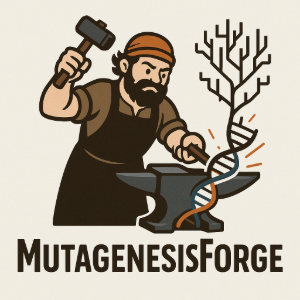

**Cooper Koers**, [Rob Bierman](https://researchcomputing.princeton.edu/about/people-directory/rob-bierman), [Huixin Xu](https://lsi.princeton.edu/people/winnie-xu), [Joshua M. Akey](https://lsi.princeton.edu/people/joshua-akey)



**MutagenesisForge** is a modular command-line tool and Python package for simulating codon-level mutagenesis and calculating dn/ds ratios under under user-specified conditions so that biologically relevant null models of selection can be made for selection analyses.

The pre-print is coming soon!

MutagenesisForge is available for download via ```pip```

```pip install MutagenesisForge```

[Paper](about:blank) | [Github Repo](https://github.com/AkeyLab/MutagenesisForge)